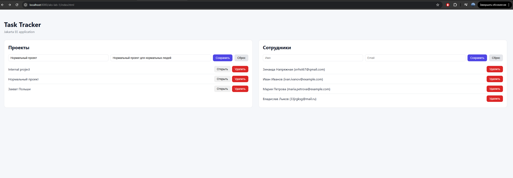
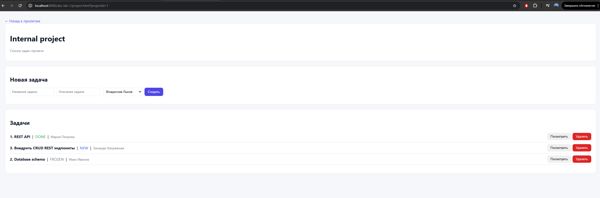
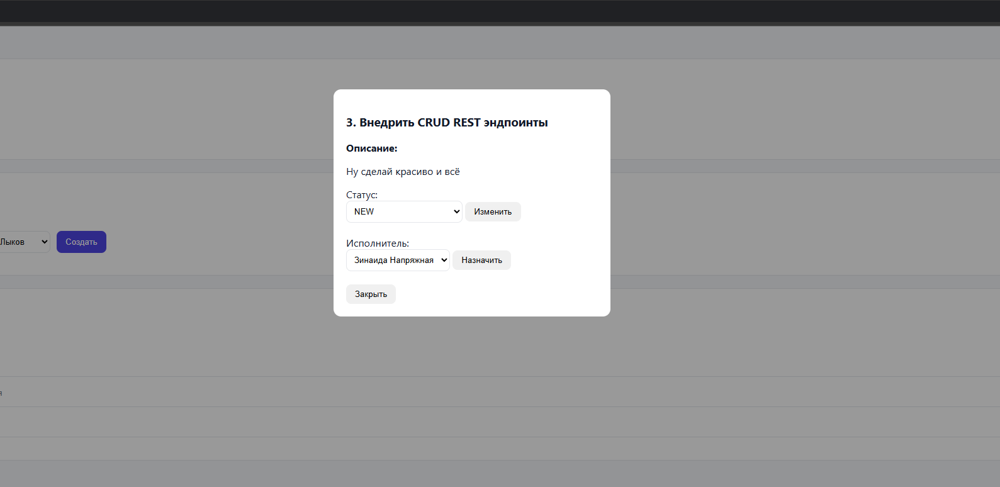
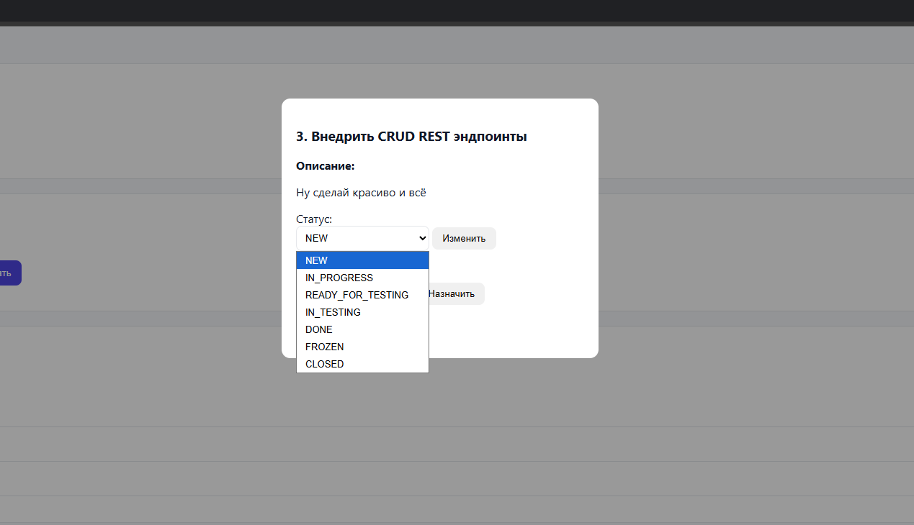

# Практическая работа №1

### Приложение с типовой архитектурой JakartaEE

**Task Tracker** - учебное веб-приложение для управления проектами и задачами.
Приложение позволяет создавать проекты, добавлять задачи в рамках проекта,
назначать исполнителей, управлять статусами задач и удалять данные.

Проект разработан с использованием типовой многоуровневой архитектуры Jakarta EE
и демонстрирует работу с JPA, EJB, REST API и простым web-интерфейсом.

### Стек технологий

Backend:
- Jakarta EE 10
- JAX-RS (REST API)
- JPA (EclipseLink)
- Stateless EJB
- PostgreSQL

Frontend:
- HTML5
- CSS
- JavaScript (без фреймворков)

Infrastructure:
- GlassFish 7
- JDBC DataSource
- Liquibase

### Реализация требований задания

#### Архитектура приложения

Приложение разработано с использованием типовой многоуровневой архитектуры Jakarta EE и состоит из трёх слоёв:

- Слой данных - JPA-сущности, описывающие предметную область и подготовленные для работы с Entity Persistence.

- Бизнес-слой - Stateless EJB-сервисы, реализующие CRUD-операции и бизнес-логику.

- Слой представления - web-интерфейс на основе HTML, CSS и JavaScript, взаимодействующий с backend через REST API.

#### Сервер приложений

В качестве сервера приложений используется GlassFish.
Развёртывание приложения выполняется через консоль администратора и конфигурацию сервера, без использования IDE.

#### База данных

В проекте используется реляционная СУБД PostgreSQL.
Для работы с базой данных настроен JDBC DataSource.
Создание структуры БД и начальное заполнение данных выполняется с помощью Liquibase.

#### Предметная область

В рамках выбранной предметной области реализованы следующие сущности:

- Project - проект, объединяющий задачи
- Task - задача проекта с жизненным циклом и назначенным исполнителем
- User - пользователь (исполнитель задач)

Между сущностями реализованы связи One-to-Many и Many-to-One.

#### Бизнес-логика

Бизнес-логика реализована в виде Stateless EJB-компонентов и включает:

- CRUD-операции для проектов, задач и пользователей
- создание задач с инициализацией обязательных полей
- управление статусами задач (несколько состояний жизненного цикла)
- назначение и смену исполнителя задачи

### REST API

Для взаимодействия клиентской части с сервером реализован REST API на основе JAX-RS.

#### User API

| HTTP метод | Endpoint      | Описание                                |
| ---------- | ------------- | --------------------------------------- |
| GET        | `/users`      | Получить список всех пользователей      |
| GET        | `/users/{id}` | Получить пользователя по идентификатору |
| POST       | `/users`      | Создать нового пользователя             |
| DELETE     | `/users/{id}` | Удалить пользователя                    |

#### Project API

| HTTP метод | Endpoint         | Описание                          |
| ---------- | ---------------- | --------------------------------- |
| GET        | `/projects`      | Получить список всех проектов     |
| GET        | `/projects/{id}` | Получить проект по идентификатору |
| POST       | `/projects`      | Создать новый проект              |
| DELETE     | `/projects/{id}` | Удалить проект                    |

#### Task API

| HTTP метод | Endpoint                       | Описание                                |
| ---------- | ------------------------------ | --------------------------------------- |
| GET        | `/tasks?projectId={projectId}` | Получить список задач проекта           |
| POST       | `/tasks`                       | Создать задачу в проекте                |
| DELETE     | `/tasks/{id}`                  | Удалить задачу                          |
| PUT        | `/tasks/{id}/status`           | Изменить статус задачи                  |
| PUT        | `/tasks/{id}/assignee`         | Назначить / изменить исполнителя задачи |

### Слой представления

Слой представления реализован в виде web-интерфейса на HTML, CSS, JS.

Интерфейс позволяет:

- создавать и удалять проекты
- добавлять и удалять сотрудников

- создавать, просматривать, изменять и удалять задачи

- управлять статусами задач

- назначать и переназначать исполнителей

